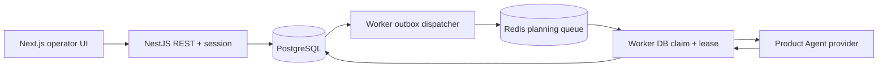

# M1 architekturális döntések

Dátum: 2026-10-06. Az irányadó specifikáció: `docs/SPEC.md`. M2/M3 viselkedés nem része ennek az implementációnak.

## ADR-01 · Egy monorepo, három külön processz

NestJS API, Next.js web, BullMQ worker. A web ugyanazon originen proxyzza a REST API-t. Controllerben csak routing; serviceben DTO/response validáció; repositoryban tranzakciós persistence. A `workflow` package mindkét processz determinisztikus állapotgépét adja. PostgreSQL az igazság forrása, Redis a kézbesítés és session/rate-limit tárolója.

## ADR-02 · Tranzakciók és idempotencia

A command receipt kulcsa `(operation, actorId, key)`. A SHA-256 hash a kanonizált bodyt és resource ID-t tartalmazza. Tranzakciós PostgreSQL advisory lock először a receipt kulcson, majd a task ID-n; ezt minden taskot módosító repositoryút követi. Ezután az aktuális adatot újraolvassuk. A plan approval a konkrét aktuális plan ID-t, pending approvalt és expected task versiont ellenőrzi. A döntés, event, task transition, új run/outbox és receipt egy tranzakcióban commitol.

A `Task.version` minden állapotváltozásnál nő. Egy partial unique index taskonként egy QUEUED/RUNNING logical runt enged. Composite foreign key-k érvényesítik a project/task/run/plan/approval összetartozását, beleértve a ciklikus pointereket. Az ORM által nem kifejezett constraint-ek a migrációban szerepelnek; `db push` helyett **migrate deploy** szükséges.

A TaskPlan, Event, CommandReceipt DB triggerrel változtathatatlan. Az AgentRun inputSnapshot, promptVersion, provider és parent ID-k módosítása szintén tiltott. Új tervhez új run és tervverzió tartozik. Az explicit retry új logical runt kap, de megőrzi a failed run task/context/previous-plan/change-request snapshotját. A snapshot tartalmazza a korábbi tervet és a módosításkérést; nincs agentoldali kontextusmutáció.

## ADR-03 · Outbox, lease és crash recovery

Job ID `planning-<runUUID>`, payload csak project/task/run UUID. A dispatcher DB-commit után publikál, majd jelöli DISPATCHED állapotúnak az outboxot. Kézbesítés utáni, acknowledgement előtti crash ismételt addot okozhat. A BullMQ ID csak első deduplikációs réteg.

A worker DB-claimje új UUID ownership tokent, élő lease-t és külön attemptet hoz létre. Heartbeat csak még élő lease-t hosszabbíthat. Egyetlen aktív jobot a Redisben tárolt BullMQ **global concurrency 1** korlátoz több worker mellett is. A queue delivery attempts=1; az üzleti retryt a DB attempt counter (maximum 3), nextAttemptAt, exponenciális backoff és jitter vezérli.

A dispatcher a már DISPATCHED, továbbra is aktív runokat is egyezteti. Így elveszett Redis job, completed/failed delivery vagy kimerült stalled retry után újra kézbesíthet. A PENDING outbox saját backoffját ez nem kerüli meg. Lejárt lease utáni claim az előző attemptet INTERRUPTED-re zárja. A completion task lock mellett ellenőrzi a tokent, lease-t, aktív runt és státuszt; a végső run-update feltételes, lejárt lease esetén az egész tervtranzakció rollbackel.

A providerhívás nincs DB-tranzakcióban. Attempt timeoutkor AbortSignal érkezik, de a futás időkorlátját Promise.race is biztosítja a nem együttműködő adapterek ellen. DB-finalization hiba nem lesz hamis provider error: a lease recovery veszi át. Cancellation azonnal lezárja a taskot/runt/approvalt; kései eredményből csak az adott attempt elszámolása frissülhet. Ismert usage/költség nem írható felül nullal.

**Garanciahatár:** egy DB-terv/approval/completion event logical runonként; nem exactly-once külső LLM hívás. Crash után providerhívás ismétlődhet, és usage hiányozhat. Queue concurrency nem garantálja, hogy a provider egy abortált távoli hívást azonnal leállít.

## ADR-04 · Providerhatár és ellenőrzött SDK

A kis `AgentProvider` interface generikus input/outputtípust, AbortSignalt, usage-t és tényleges model/request ID-t ad. M1-ben csak a Product Agent használja. A DEMO determinisztikus onboarding fixture; az OPENAI adapter `Agent`, Zod `outputType`, `Runner.run`, `finalOutput`, `OpenAIProvider({openAIClient,useResponses:true})` felületeket használ.

Ellenőrzés: hivatalos [Agent definitions](https://developers.openai.com/api/docs/guides/agents/define-agents), [Running agents](https://developers.openai.com/api/docs/guides/agents/running-agents), [Models and providers](https://developers.openai.com/api/docs/guides/agents/models), [GPT-4.1 mini](https://developers.openai.com/api/docs/models/gpt-4.1-mini), valamint a telepített 0.19.0 SDK TypeScript deklarációi. A schema csak provider-kompatibilis alakot kér; a külön BusinessPlanSchema nemüres mezőket, limiteket és lépéssorrendet ellenőriz.

`openai` kliens `maxRetries:0`, agent model settings `retry.maxRetries:0`, `maxTurns:1`, `maxTokens:6000`, `store:false`, tracing kikapcsolva. Nincs tool, shell, repositoryhozzáférés vagy sandbox API. A prompt tiltja a nem végzett kutatás, fájlolvasás és tesztelés állítását, az inputot adatként kezeli. A modell döntése nem változtathat task státuszt vagy approvalt.

A transport wrapper a valódi Responses válaszból csak model/usage/request ID/refusal metadatát emel ki. Ez a validáció előtt történik, ezért a refusal vagy hibás output ismert költsége is megmarad. A normalizált SDK default nulla helyett hiányzó usage null. Auth/config, refusal és hibás output nem automatikusan retryolható; 429/network/5xx és timeout legfeljebb a DB attempt limitig.

## ADR-05 · Biztonság és operátori session

Lokális, egyoperátoros rendszer; a project ID nem többfelhasználós jogosultság. Jelszó és session secret csak env; a setup kriptográfiai véletlen értékeket generál. HttpOnly/SameSite cookie, aláírás és lejárat, visszavonható Redis session, atomikus login rate limit. Író kérésnél Origin + JSON + CSRF token; actor kizárólag sessionből. A DB/Redis/API/web loopbackre kötött. Nincs public deployment és nincs hostkonfiguráció-módosítás.

Az API kizárólag biztonságos kódot, üzenetet és correlation ID-t ad hibánál. A saját audit tartós és append-only; request body, provider nyers hiba és secret nem naplózható. Snapshot/terv szükséges projektadatokat tárol PostgreSQL-ben, nem chain-of-thoughtot. Az OpenAI kulcsot csak a worker tölti be `.env.worker` fájlból; a közös launcher az API/web gyermekfolyamatoktól is elvonja az örökölt OpenAI kulcsot.

## ADR-06 · UI és wire contractok

Négy elsődleges oldal, angol UI, 2 másodperces aktív polling. A kliens és API ugyanazokat a Zod response contractokat használja; OpenAPI ezekből generálódik. Dátum ISO UTC string, pénz Decimalből decimális string + USD currency. Nincs mock API, WebSocket vagy fejlesztést imitáló gomb. Terminális tasknál megmaradnak a verziók és próbálkozások, de nincs következő M2 job.

## ADR-07 · Dependency-rögzítés

A registryben ellenőrzött és együtt install/typecheck/build/integráció/E2E során validált verziók:

| Elem                                | Rögzített verzió           |
| ----------------------------------- | -------------------------- |
| Node / pnpm                         | 24.10.0 / 10.34.6          |
| TypeScript                          | 5.9.3                      |
| NestJS common/core/platform-express | 12.1.2                     |
| Next.js / React                     | 16.3.8 / 19.3.0            |
| Prisma / @prisma/client             | 6.19.3                     |
| BullMQ / ioredis                    | 6.3.11 / 6.0.0             |
| @openai/agents / openai / Zod       | 0.19.0 / 7.28.0 / 4.6.5    |
| ESLint / typescript-eslint          | 10.12.0 / 8.71.1           |
| Vitest / Playwright                 | 3.2.7 / 1.63.0             |
| PostgreSQL / Redis Compose image    | 17.6-alpine / 7.4.6-alpine |

A Prisma 6 stabil migrációs/client felületét tudatosan tartjuk; nem szükséges major migrációt beemelni M1-be. A pnpm 10 fut a tesztelt Node-on, lockfile-ja rögzíti a tranzitív dependency-ket. Az opcionális `msgpackr-extract` natív build nincs engedélyezve; a JS útvonalat a BullMQ integrációtesztek ténylegesen használják. A Next dev által generált `apps/web/AGENTS.md`/`CLAUDE.md` fájlokat megőrizzük; a generált `next-env.d.ts` ignorált, typecheck előtt `next typegen` állítja elő.

## ADR-08 · Teszt- és scope-határ

Offline provider teszt a valódi Agents SDK felett kontrollált HTTP transporttal, hálózati modellhívás nélkül. Integráció valós PostgreSQL/Redis, saját ideiglenes sémák/queue prefixek. Crash teszt valódi gyermekprocessz SIGKILL és új worker. Browser E2E három valódi processzel. Live smoke külön parancs és eredmény; kulcs hiányában M1 offline készültség nem jelent valódi AI-val teljes elfogadást.
